# CERT-IS

  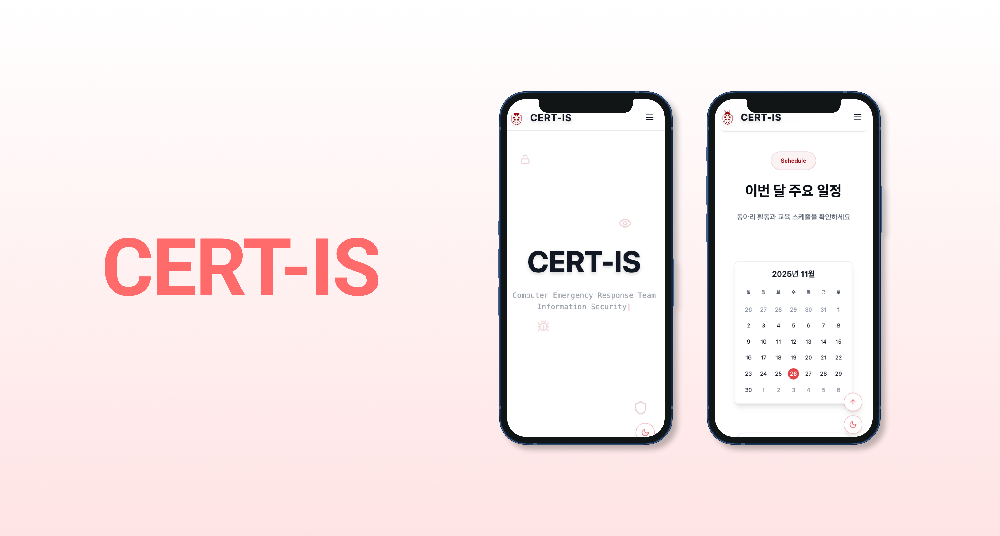

 

## 목차

- [📝 프로젝트 소개](#introduction)
- [🛠️ 기술 스택](#tech)
- [🚀 도메인](#domain)
- [🌟 주요 기능](#function)
- [🧑🏻‍💻 프로젝트 멤버](#member)

 

## 📝 프로젝트 소개

- **프로젝트 기간** : 2025.07 ~ 2025.10
- **목적**
  - 부경대학교 정보 보안 동아리 CERT-IS의 공식 홈페이지로, 동아리 소개 및 활동 정보 제공, 회원 및 활동 관리 자동화를 통해 운영 효율성 향상과 대외 인지도 강화를 목적으로 개발하였습니다.

- **기대 효과**
  - CERT-IS 홈페이지를 통해 동아리 소개, 공지사항, 스케줄, 활동 기록 (스터디, 프로젝트 등), 가입 신청 등 대외 인지도를 증대할 수 있습니다.
  - **임원진**
    - 기존 Notion으로 관리하던 동아리 활동(스터디, 프로젝트)과 회원 정보를 홈페이지에서 통합 관리함으로써 운영 효율성을 높이고 더 체계적으로 관리할 수 있습니다.
    - 활동에 참여중인 회원 목록을 한 눈에 파악할 수 있어 활동 진행 상황 관리와 운영이 더욱 수월합니다.
  - **회원** - 현재 진행 중인 스터디와 프로젝트를 쉽게 확인할 수 있으며, '참가 신청' 기능을 통해 쉽게 활동에 참여할 수 있어 동아리 활동 참여율을 높일 수 있습니다.

 

## 🛠️ 기술 스택

<table>
  <thead>
    <tr>
      <th>분류</th>
      <th>기술 스택</th>
    </tr>
  </thead>
  <tbody>
    <tr>
      <td>프론트엔드</td>
      <td>
        
        
        
        
      </td>
    </tr>
    <tr>
      <td>백엔드</td>
      <td>
        
        
        
      </td>
    </tr>
    <tr>
      <td>데이터베이스</td>
      <td>
        
        
      </td>
    </tr>
    <tr>
      <td>인프라</td>
      <td>
        
        
        
        
        
        
      </td>
    </tr>
  </tbody>
</table>

 

## 🚀 도메인

| 구분                   | 도메인                                                                                                             |
| ---------------------- | ------------------------------------------------------------------------------------------------------------------ |
| **전체 공개 도메인**   | 동아리 소개(Home), 블로그(Blog, 외부 공개 선택 가능), 회원 정보(Members), 회원가입(Sign up), 로그인(Login)         |
| **회원 전용 도메인**   | 공지사항(Board), 스케줄(Schedule), 스터디(Study), 프로젝트(Project), 블로그(Blog, 내부 기본 접근), 프로필(Profile) |
| **관리자 전용 도메인** | 대시보드, 스케줄 관리, 스터디/프로젝트 관리, 블로그 관리, 회원 관리                                                |

 

## 🌟 주요 기능

### 유저 페이지

- **Auth 페이지**
  - **로그인 (Login)** : DB에 저장된 회원 정보를 기반으로 입력한 아이디와 비밀번호를 검증하여 로그인할 수 있습니다.
    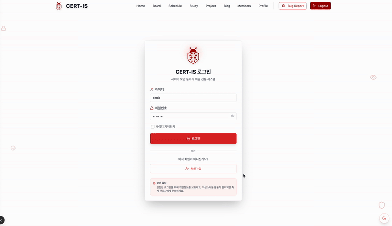

  - **회원가입 (Sign Up)** : 회원 정보를 입력하여 회원가입을 할 수 있습니다.
    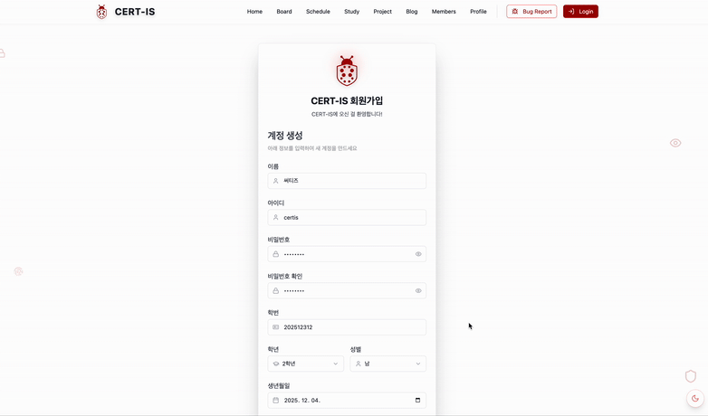

 
    
- **메인 페이지**
  - **동아리 소개 (Home)**
    - CERT-IS 소개 및 미니 캘린더를 통해 이번 달 스케줄 정보를 확인할 수 있습니다.
      

 

- **공지사항 (Board)**
  - 임원진이 공지사항을 작성하거나 회원이 소개하고자 하는 정보가 있으면 작성하여 모든 회원이 볼 수 있습니다.
    

    <table>
    <tr>
    <td>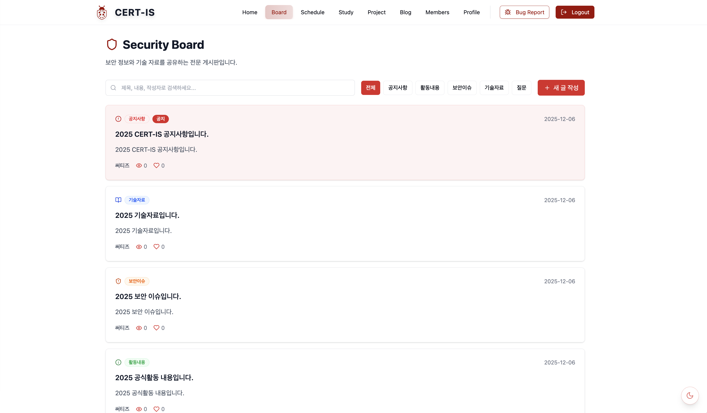</td>
    <td>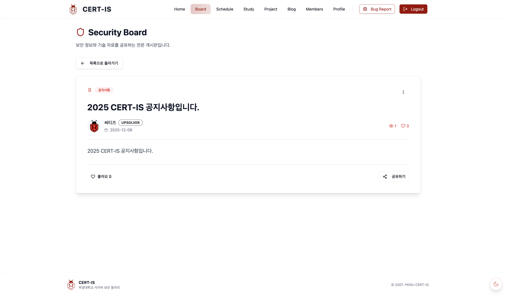</td>
    </tr>
    <tr>
    <td align="center">공지사항 목록</td>
    <td align="center">공지사항 상세 내용</td>
    </tr>
    </table>
    

 

- **스케줄 (Schedule)**
  - CERT-IS의 전체 일정을 확인할 수 있고, 동아리방 예약이 가능합니다.
    

    <table>
    <tr>
    <td>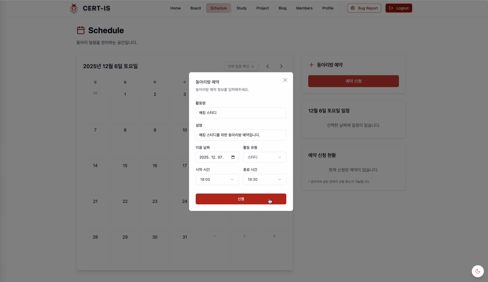</td>
    <td>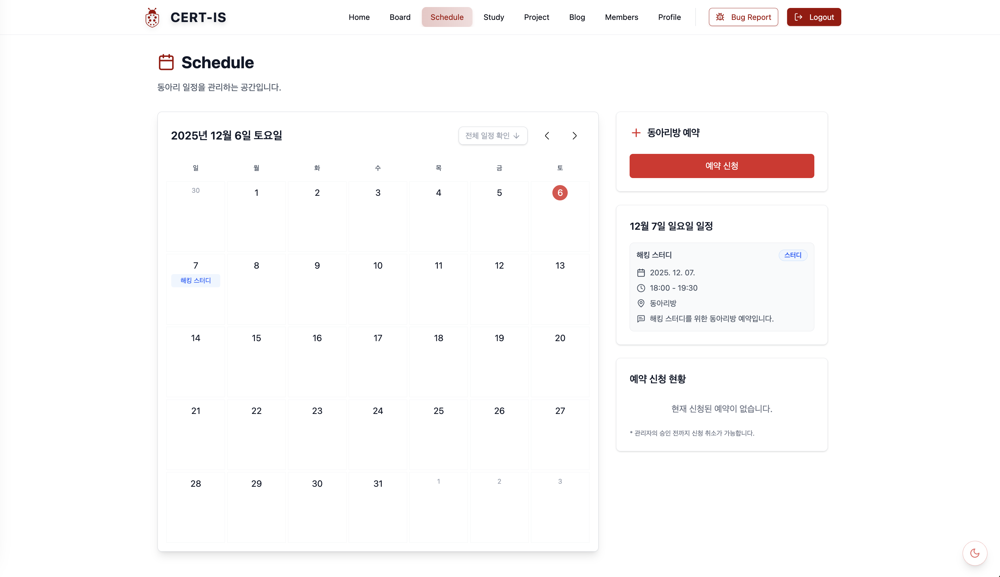</td>
    </tr>
    <tr>
    <td align="center">스케줄 신청</td>
    <td align="center">스케줄</td>
    </tr>
    </table>
    

 

- **스터디 (Study)**
  - 스터디장이 스터디를 생성할 수 있고, 회원은 원하는 스터디에 참가 신청이 가능합니다. 이때 모든 스터디는 1주 ~ 2개월동안 수행 가능합니다.
    

    <table>
    <tr>
    <td>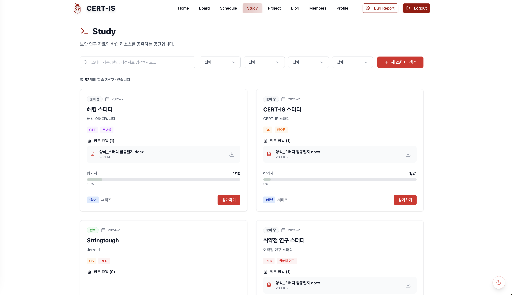</td>
    <td>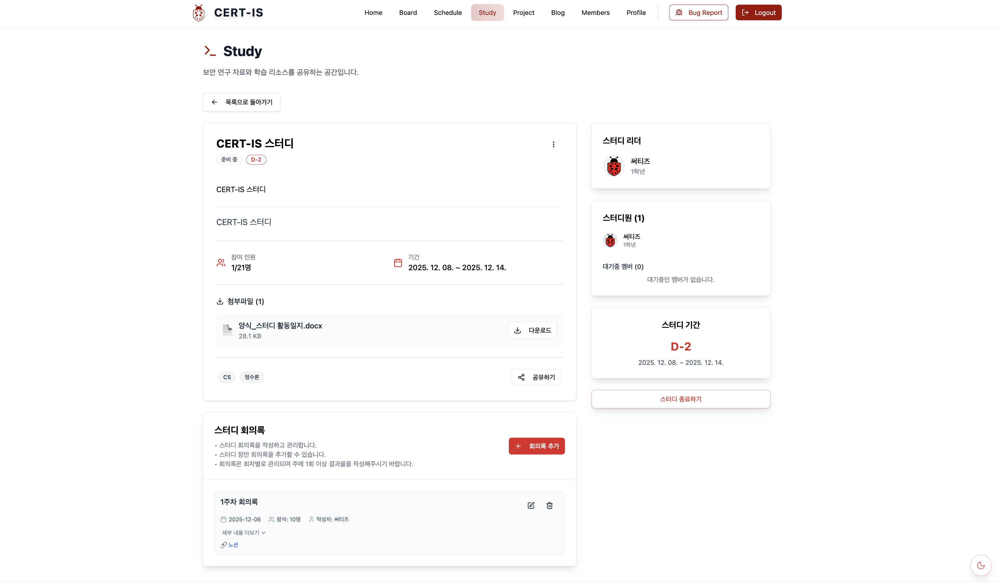</td>
    </tr>
    <tr>
    <td align="center">스터디 목록</td>
    <td align="center">스터디 상세 내용</td>
    </tr>
    </table>
    

 

- **프로젝트 (Project)**
  - 프로젝트장이 프로젝트를 생성할 수 있고, 회원은 원하는 프로젝트에 참가 신청이 가능합니다. 이때 모든 프로젝트는 2주 ~ 6개월동안 수행 가능합니다.
    

    <table>
    <tr>
    <td>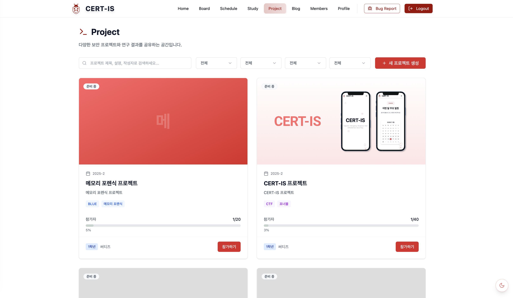</td>
    <td>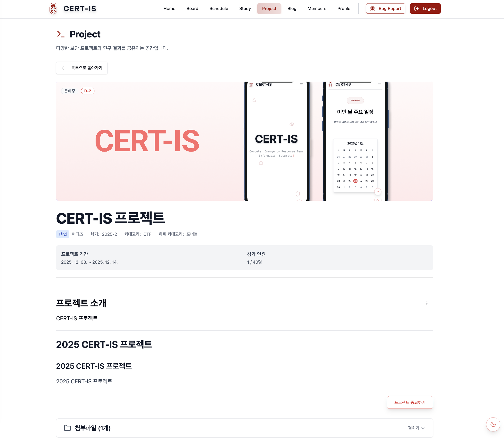</td>
    </tr>
    <tr>
    <td align="center">프로젝트 목록</td>
    <td align="center">프로젝트 상세 내용</td>
    </tr>
    </table>
    

 

- **블로그 (Blog)**
  - 모든 스터디 또는 프로젝트 종료 시 스터디장은 활동의 결과물을 작성하여 모든 회원이 해당 스터디(프로젝트)의 결과물을 볼 수 있습니다.
  - 모든 블로그는 외부 공개 및 비공개 선택이 가능합니다.
    

    <table>
    <tr>
    <td>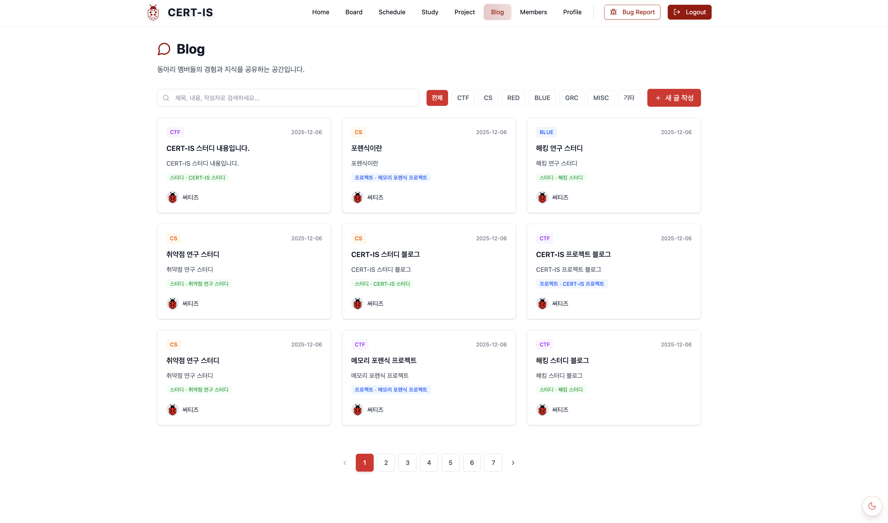</td>
    <td>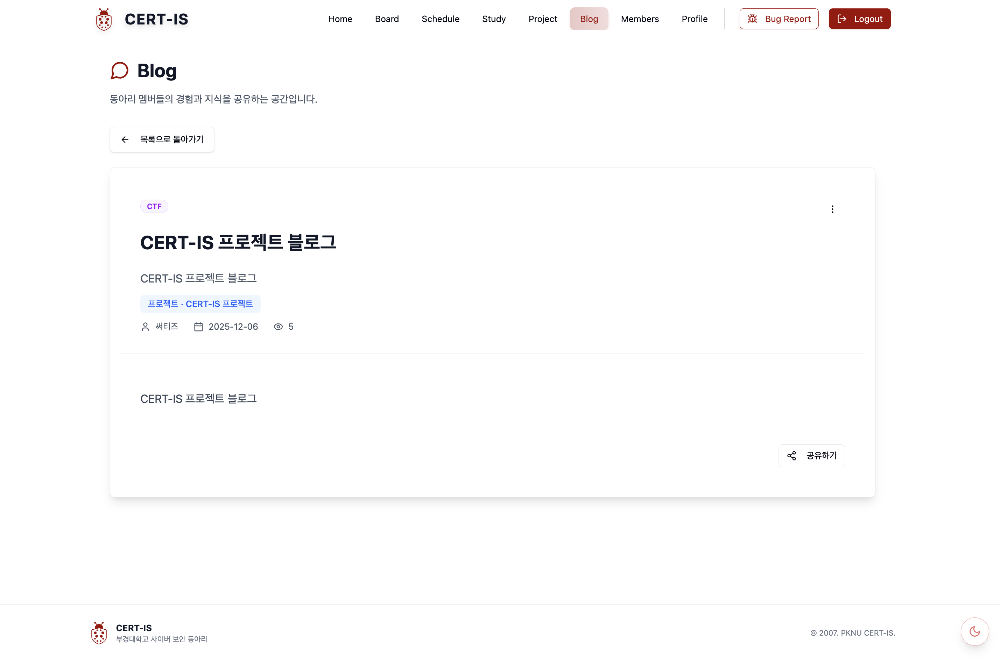</td>
    </tr>
    <tr>
    <td align="center">블로그 목록</td>
    <td align="center">블로그 상세 내용</td>
    </tr>
    </table>
    

 

- **회원 정보 (Members)**
  - 회원들의 이메일, Github, LinkedIn을 볼 수 있습니다.
  - 검색 기능을 통해 회원을 검색할 수 있습니다.
    

      <table>
        <tr>
          <td>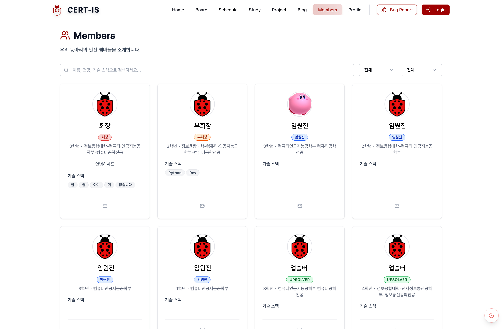</td>
        </tr>
        <tr>
          <td align="center">멤버 목록</td>
        </tr>
      </table>
    

 

- **프로필 (Profile)**
  - 본인의 스터디 및 프로젝트 기록, 블로그 작성 내역을 확인할 수 있으며, 프로필 수정이 가능합니다.
  - 본인의 벌점 점수와 벌점 유예 기간을 확인할 수 있습니다.
    

    <table>
    <tr>
    <td>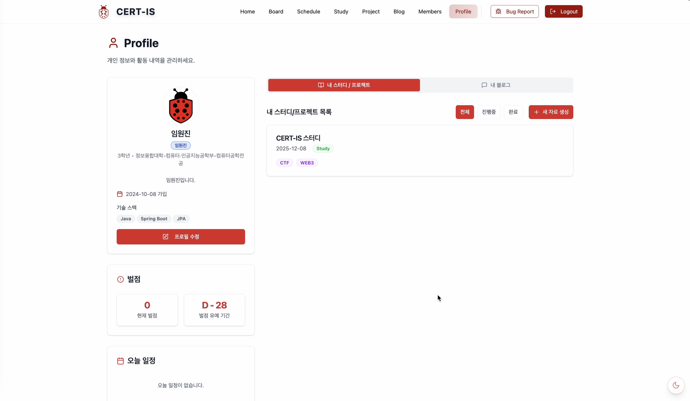</td>
    <td>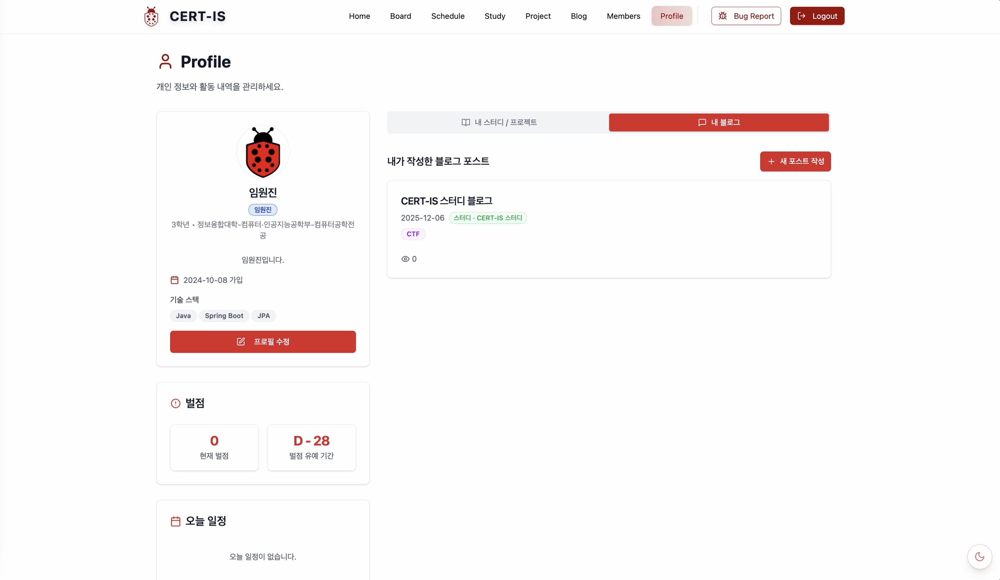</td>
    </tr>
    <tr>
    <td align="center">프로필 (내 스터디/프로젝트)</td>
    <td align="center">프로필 (내 블로그)</td>
    </tr>
    </table>
    

 

### 관리자 페이지

- **대시보드 (통계, 회원가입 관리, 탈퇴 위험 회원 정보)**
  - **통계**
    - 스터디 및 프로젝트 개설 통계를 확인할 수 있습니다.

  - **탈퇴 위험 회원 정보**
    - 벌점 3점 이상의 회원이 표시되어 집중 관리할 수 있습니다.
      

  - **회원가입 관리** - 관리자가 실제 동아리 회원인지 여부를 판별해 승인/거절합니다.
    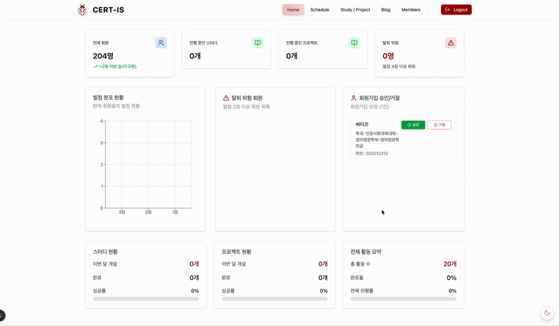

 

- **스케줄 관리**
  - 회원이 신청한 동아리방 예약을 관리하고, 공식 일정을 등록할 수 있습니다.
    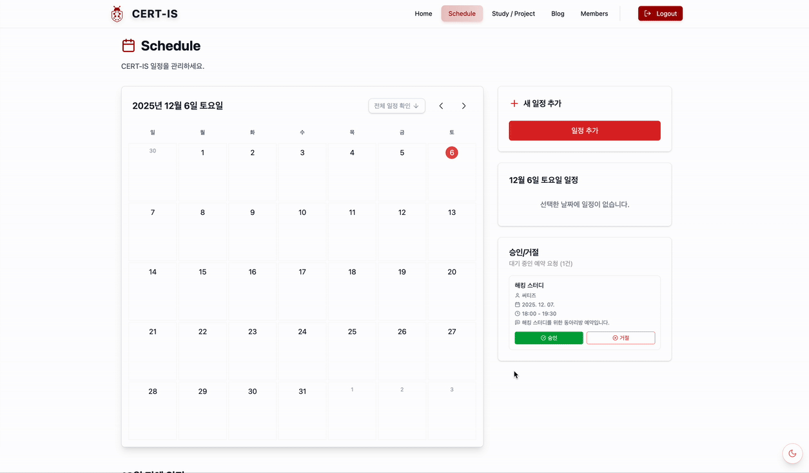

 

- **스터디 및 프로젝트 관리**
  - 모든 스터디 내역과 개설 신청한 스터디, 종료 요청한 스터디를 확인하여 승인/거절할 수 있습니다.
    

    <table>
    <tr>
    <td>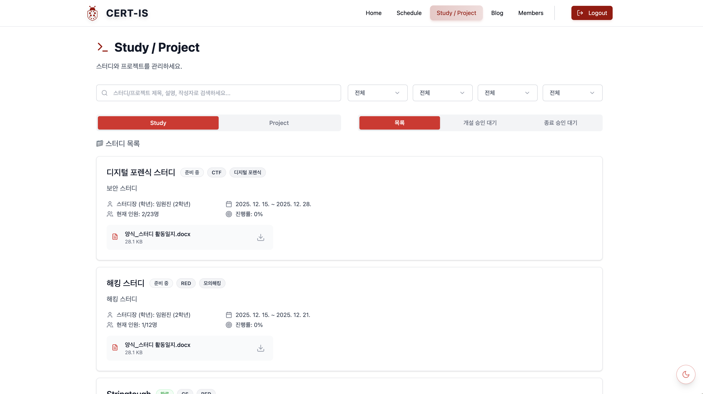</td>
    <td>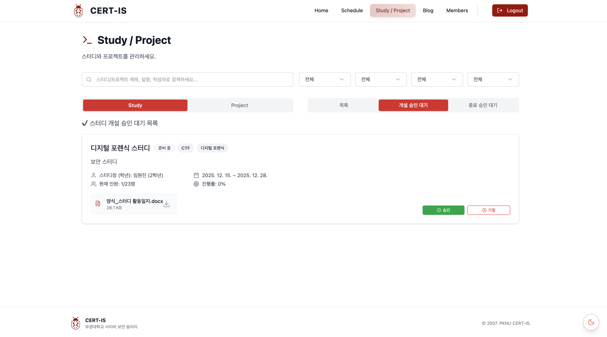</td>
    <td>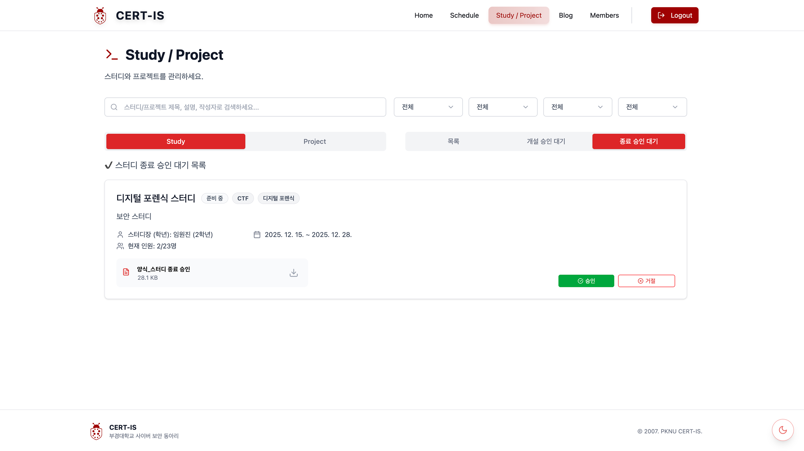</td>
    </tr>
    <tr>
    <td align="center">스터디 (프로젝트) 목록</td>
    <td align="center">스터디 (프로젝트) 개설 승인 목록</td>
    <td align="center">스터디 (프로젝트) 종료 승인 목록</td>
    </tr>
    </table>
    

 

- **블로그 관리**
  - 회원이 작성한 블로그 내역을 관리하고, 외부 공개 및 비공개 여부를 설정할 수 있습니다.
    

    <table>
    <tr>
    <td>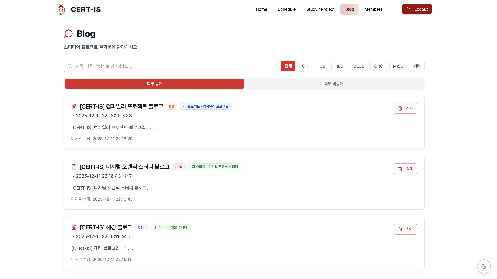</td>
    <td>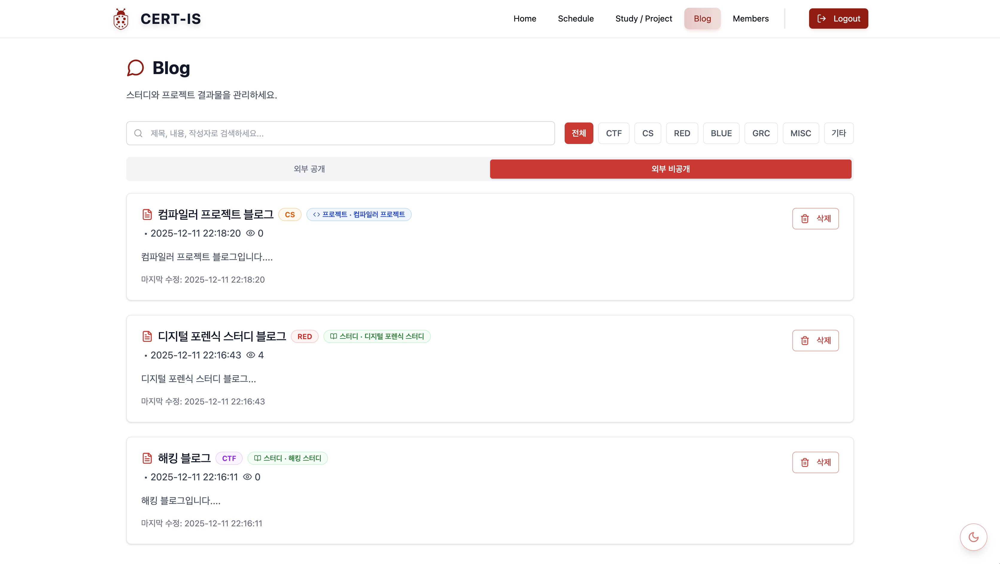</td>
    </tr>
    <tr>
    <td align="center">블로그 외부 공개 목록</td>
    <td align="center">블로그 외부 비공개 목록</td>
    </tr>
    </table>
    

 

- **회원 관리**
  - 모든 회원의 기본 정보와 벌점, 벌점 유예 기간을 관리할 수 있습니다.
  - 모든 회원의 기본 정보를 CSV, EXCEL로 추출이 가능하여 회원 정보를 수월하게 확인할 수 있습니다.
    

    <table>
    <tr>
    <td>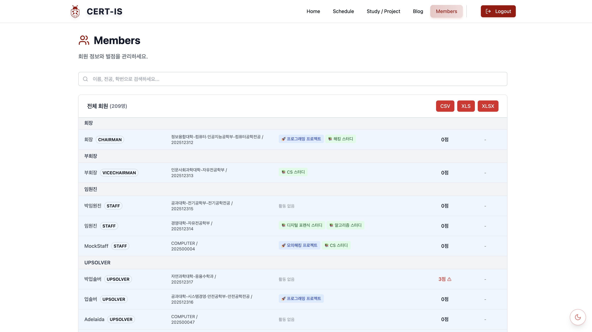</td>
    <td>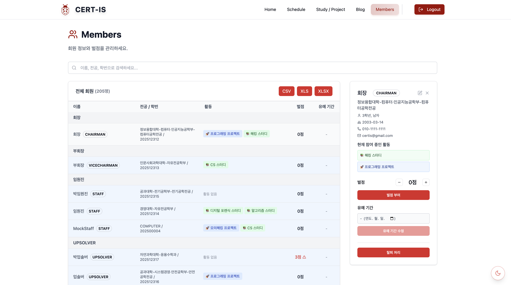</td>
    </tr>
    <tr>
      <td align="center">멤버 목록</td>
      <td align="center">멤버 상세 정보</td>
    </tr>
    </table>
    

 

### 에러 페이지

- **403, 404 에러**
  

  <table>
  <tr>
  <td>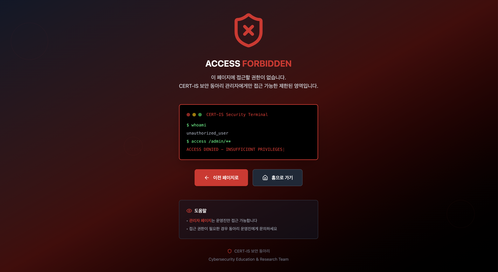</td>
  <td></td>
  </tr>
  <tr>
  <td align="center">403 에러</td>
  <td align="center">404 에러</td>
  </tr>
  </table>
  

 

## 🧑🏻‍💻 프로젝트 멤버

|                  이름                   | 역할               |
| :-------------------------------------: | :----------------- |
| [민영재](https://github.com/yeomin4242) | PM, FE, BE, Design |
| [민웅기](https://github.com/minwoonggi) | FE, BE, Design     |
|   [김주희](https://github.com/joooii)   | FE, Design         |
